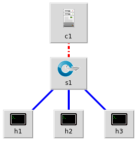

# Integrácia sietí - Dokumentácia

**Autori:** Miroslav Kozák, Andrej Šišila, Marián Vachalík

**Téma:** SDN firewall

## Realizácia

### Nasadenie Mininet prostredia

1. Stiahneme Mininet VM z [oficiálnej stránky](https://github.com/mininet/mininet/wiki/Mininet-VM-Images)
1. Po rozbalení zipu spustíme súbor s koncovkou `.ovf`. Následne sa zobrazí dialógové okno na importovanie Mininet VM do nástroja VirtualBox (ďalej len VBox). Nastavenia ponecháme na predvolených hodnotách a klikneme na *Import*.
1. Po úspešnom importovaní Mininet VM do nástroja VBox na ňu klikneme pravým tlačidlom a zvolíme *Settings*. Otvorí sa dialógové okno s nastaveniami VM. Zmeníme tieto nastavenia:
    1. **Network**

        1. Ak sme na internet pripojený káblom, stačí zapnúť jeden sieťový adaptér - *Adapter 1*. Pre *Adapter 1* zvolíme *Bridged Adapter*. Všetky ostatné adaptéry vypneme - odškrtneme voľbu *Enable Network Adapter*.

        1. Ak sme na internet pripojený bezdrôtovo, napr. cez Wi-Fi, *Bridged Adapter* nám nefungoval správne. Museli sme použiť dva sieťové adaptéry: *NAT* a *Host-only Adapter*. Typ sieťového adaptéra nastavíme v riadku *Attached to:*. *NAT* bude slúžiť na pripojenie k internetu, *Host-only Adapter* bude slúžiť na prácu s topológiou. Po stiahnutí všetkých potrebných súborov z internetu internetové pripojenie pre beh topólogie v Mininet VM nie je potrebné.

            1. Najprv vytvoríme nový *Host-only Adapter* tak, že zatvoríme dialógové okno s nastaveniami a v hlavnom VBox okne v hornom menu riadku klikneme na *File -> Host Network Manager...*.
            1. Otvorí sa dialógové okno *Host Network Manager*. Klikneme na tlačidlo *Create*, čo vytvorí nový *Host-only* sieťový adaptér s názvom napr. "vboxnet0".
            1. Pre adaptér aktivujeme DHCP zaškrtnutím voľby "Enable" v stĺpci "DHCP Server".
            1. Zatvoríme dialógové okno *Host Network Manager* a znovu otvoríme dialógové okno s nastaveniami pre Mininet VM.
            1. V ľavom stĺpci zvolíme možnosť *Network*. Nastavenia jednotlivých adaptérov upravíme nasledovne:

                * Adapter 1
                    * zaškrtneme *Enable Network Adapter*
                    * *Attached to:* NAT.

                * Adapter 2
                    * zaškrtneme *Enable Network Adapter*
                    * *Attached to:* Host-only Adapter
                    * Name: vboxnet0
                    * Klikneme na *Advanced* a nastavíme *Promiscuous Mode:* Allow All (pre istotu)

                Adapter 3, Adapter 4 - vypnuté t.j. možnosť *Enable Network Adapter*

1. Spustíme Mininet VM.
1. Po spustení sa do Mininet VM prihlásime pod predvolenými prihlasovacími údajmi `mininet/mininet`
1. Za ideálnych podmienok DHCP pridelí IP adresy Ethernet rozhraniu (káblové pripojenie), resp. adaptéru *2* pri bezdrôtovom pripojení. Avšak adaptér *1* môže byť stále vypnutý, čo skontrolujeme príkazom `ip a` v príkazovom riadku Mininet VM. Neinicializovaný adaptér sa zobrazil ako `eth1`. Vyžiadame si IP adresu pre toto rozhranie príkazom

        sudo dhclient eth1

### Vytvorenie topológie

1. Na vytvorenie a prácu s Mininet topológiou je potrebné mať k Mininet VM otvorené 2 SSH relácie: prvá slúži na interakciu s Mininet topológiou prostredníctvom nástroja Miniedit, druhá slúži na manipuláciu s radičom.
1. Pripojíme sa na Mininet VM pomocou SSH s aktivovanou funkciou *X11 Forwarding*. Prihlásime sa s predvolenými prihlasovacími údajmi.
    1. Vo OS Windows sa na Mininet cez SSH s *X11 Forwarding* funkciou pripojíme pomocou [*Putty*](https://www.chiark.greenend.org.uk/~sgtatham/putty/latest.html). Ešte predtým ale musíme nainštalovať [*Xming*](https://sourceforge.net/projects/xming/files/latest/download). *Xming* pridá do *Putty* funkciu *X11 Forwarding*. IP adresu Mininet VM zistíme príkazom `ip a` na rozhraní “eth0”. Po nainštalovaní *Xming* a *Putty* otvoríme *Putty*. V *Putty* aktivujeme v časti *Connection -> SSH -> X11* sme aktivovali *X11 Forwarding* zaškrtnutím políčka "Enable X11 forwarding". Klikneme na 
    1. Na platforme Linux použijeme príkaz

            ssh -X mininet@<IP_adresa_Mininet_VM>

        resp.

            ssh -CY mininet@<IP_adresa_Mininet_VM>
1. V práve otvorenej SSH relácii spustíme nástroj *Miniedit*, čo je grafický nástroj na úpravu Minient topológií.

        sudo /home/mininet/mininet/examples/miniedit.py
1. V grafickom rozhraní klikneme v menu riadku na *File->Open* a otvoríme súbor [semkaTOPO.mn](semkaTOPO.mn) v adresári `/home/mininet/`. Tento súbor definuje topológiu použitú pri testovaní *SDN firewall*.

Súbory typu `*.mn` môžeme upravovať v textovom editore, napr.

        sudo vim /home/mininet/semkaTOPO.mn
Po otvorení súboru s topológiou vidíme, že súbor je napísaný vo formáte JSON. Jednotlivé kľúčové slová definujú objekty resp. prvky v topológii. Manuálna úprava súboru je užitočná vtedy, keď chceme spresniť súradnice, na ktorých sú umiestnené jednotlivé prvky topológie, čím môžeme docieliť lepší vzhľad topológie.

Topológia obsahuje 3 koncové zariadenia (Host - h1,h2,h3), prepínač (Switch - s1) a SDN radič (Controller - c1) (ďalej len *radič*).

1. V nastaveniach *Edit -> Preferences* sme zaškrtli *Start cli* a *IP Base* sme nastavili na 10.0.0.0/24.
1. Kliknutím a podržaním pravého tlačidla na koncových zariadeniach sa otvorí kontextové menu, z ktorého zvolíme možnosť *Properties*. Zariadeniam nastavíme adresáciu podľa nižšie uvedenej tabuľky.

    Zariadenie | IP adresa/Maska
    --- | ---
    h1 | 10.0.0.1/24
    h2 | 10.0.0.2/24
    h3 | 10.0.0.3/24

1. Radič *c1* nastavíme podľa nižšie uvedeného obrázka. Stlačíme a podržíme pravé tlačítko myši na kontroléri a vyberieme *Properties*).

1. Otvoríme novú SSH reláciu k Mininet VM. Tento krát *X11 Forwarding* cez SSH nie je potrebný.

        ssh mininet@<IP_adresa_Mininet_VM>

1. Spustíme radič, v našom prípade POX, v práve otvorenej SSH relácii. Radič zatiaľ spustíme iba na otestovanie, či prepínač preposiela prevádzku, a či je existuje konektivita medzi koncovými zariadeniami.

        python /home/mininet/pox/pox.py log.level --DEBUG forwarding.l3_learning &
    Ak radič pred spustením celej topológie nespustíme, prepínač pripojený ku radiču nebude preposielať prevádzku, keďže prepínač typu *Switch*, narozdiel od prepínača typu *LegacySwitch*, vyžaduje spustený radič.
1. Spustíme topológiu kliknutím na položku *Run* v menu a zvolíme možnosť *Run*.
1. V Miniedit SSH relácií zadáme do príkazového riadku `mininet>` príkaz

        pingall
    Nižšie sú uvedené výstupy príkazu `pingall` pred a po spustení radiča.

        mininet> pingall
        *** Ping: testing ping reachability
        h3 -> X X 
        h2 -> X X 
        h1 -> X X 
        *** Results: 100% dropped (0/6 received)
        mininet> pingall
        *** Ping: testing ping reachability
        h3 -> h2 h1 
        h2 -> h3 h1 
        h1 -> h3 h2 
        *** Results: 0% dropped (6/6 received)
1. **TODO DOROBIT - blizsie popisat kroky** Potom, ako bola overená funkčnosť topológie,

* miniedit ssh -> quit
* miniedit gui -> stop
* miniedit gui -> zavriet okno

## Nasadenie modulu pre SDN firewall do SDN radiča POX
**TODO - PREROBIT! funkcionality POX firewallu, ako klonovat repo z mojho gitu do mininet VM, riadenie POX firewallu skriptom, fw pravidla (csv, uprava pravidiel), testovanie firewallu**
1. Po ukončení radiča ho môžeme znova spustiť, tentokrát ale s nami vytvoreným modulom pre firewall. Pri vytváraní SDN firewall modulu sme ako základ použili už vytvorený firewall modul pre POX radič - [SDN_Firewall](https://github.com/rakeshdatta/SDN_Firewall).

        cd
        git clone https://github.com/kyberdrb/SDN_Firewall.git
1.  Otvoríme si ďalšiu SSH reláciu na mininet pomocou Putty, prihlasíme sa a dostaneme sa do zložky kontroléra pox príkazom:
mininet@mininet-vm:~$ cd /home/mininet/pox/.
1.  Spustíme POX kontrolér, ktorý bude plniť úlohu L3 SDN firewallu: mininet@mininet-vm:~/pox$ ./myacl start
1. DALSI POPIS

Zdroje:  
* https://www.virtualbox.org/manual/ch06.html#network_hostonly
* https://bbs.archlinux.org/viewtopic.php?pid=580795#p580795
* https://stackoverflow.com/questions/12145232/create-an-automatically-numbered-list/12145270#12145270
* [X11 Forwarding using Putty on Windows](https://www.youtube.com/watch?v=QRsma2vkEQE)
    